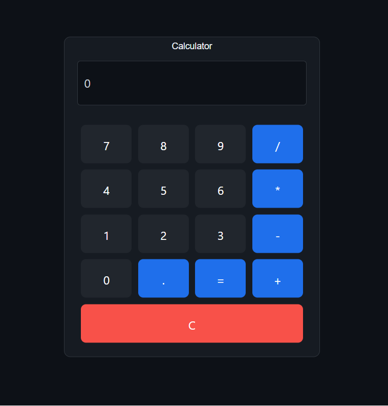

# Calculator

A simple, clean calculator web application built with HTML, CSS, and JavaScript.

## 🌟 Features

- Basic arithmetic operations (addition, subtraction, multiplication, division)
- Clear (C) button to reset calculations
- Responsive design that works on all devices
- Clean and intuitive user interface
- Real-time calculation display

## 🚀 Demo

[Live Demo](https://aslantasyakup.github.io/calculator/)

## 📸 Screenshot



## 🛠️ Technologies Used

- **HTML5** - Structure
- **CSS3** - Styling
- **JavaScript** - Functionality

## 💻 Installation & Usage

1. Clone the repository:
```bash
git clone https://github.com/aslantasyakup/calculator.git
```

2. Navigate to the project directory:
```bash
cd calculator
```

3. Open `index.html` in your browser:
```bash
# On macOS
open index.html

# On Linux
xdg-open index.html

# On Windows
start index.html
```

Or simply double-click the `index.html` file.

## 📂 Project Structure
```
calculator/
├── index.html      # Main HTML file
├── index.css       # Styling
├── index.js        # JavaScript logic
└── README.md       # Project documentation
```

## 🎯 How It Works

1. Click on number buttons to input digits
2. Select an operation (+, -, ×, ÷)
3. Click equals (=) to see the result
4. Use C button to clear and start over

## 🔮 Future Enhancements

- [ ] Keyboard support for input
- [ ] Dark/Light theme toggle
- [ ] Calculation history
- [ ] Scientific calculator mode
- [ ] Memory functions (M+, M-, MR, MC)
- [ ] Percentage calculations

## 🤝 Contributing

Contributions, issues, and feature requests are welcome! Feel free to check the [issues page](https://github.com/aslantasyakup/calculator/issues).

## 👨‍💻 Author

**Yakup Aslantas**

- GitHub: [@aslantasyakup](https://github.com/aslantasyakup)

## 📝 License

This project is open source and available under the [MIT License](LICENSE).

## ⭐ Show Your Support

Give a ⭐️ if you like this project!

---

Made with ❤️ by [Yakup Aslantas](https://github.com/aslantasyakup)